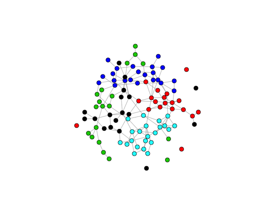

---
output:
  md_document:
    variant: markdown_github
---

<!-- README.md is generated from README.Rmd. Please edit that file -->

```{r, echo = FALSE}
knitr::opts_chunk$set(
  collapse = TRUE,
  comment = "#>",
  fig.path = "README-"
)
```

This is code for an ABM of a climate prediction market
in which traders adapt their belief about the climate based
on the monetary performance of their neighboring traders in
a social network. The ABM is meant to test whether climate
prediction markets foster the convergence of people’s beliefs
about the climate. The model will be used to
assess whether such convergence is impacted by factors such
as the initial belief-homophily in the social network or the
time horizon at which climate securities are realized.

[Martin Van der Linden](https://martinvdlinden.wordpress.com/) (Dept. of Economics, Vanderbilt University) and [John J. Nay](https://johnnay.github.io) (School of Engineering, Vanderbilt University).


Master is the main script that sources everything else.
```{r, eval=FALSE, include=TRUE}
source("master.R")
````

Here is a snapshot of the model's network of agents at an intialization:



The colors of the nodes correspond to different beliefs about the climate. 
