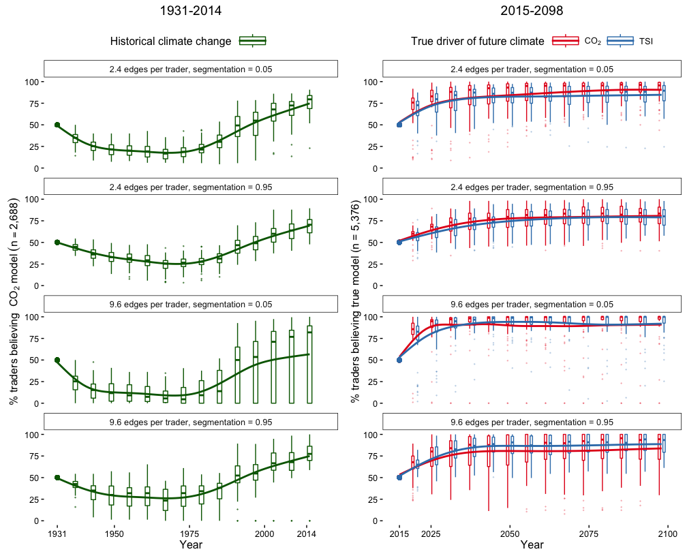

<!-- README.md is generated from README.Rmd. Please edit that file -->
Betting and Belief: Prediction Markets and Attribution of Climate Change
========================================================================

[John Nay](http://johnjnay.com/) (previously Vanderbilt University and now NYU and Skopos Labs), [Martin Van der Linden](https://martinvdlinden.wordpress.com/) (previously Dept. of Economics, Vanderbilt University, and now Emory University), and [Jonathan Gilligan](https://my.vanderbilt.edu/jonathangilligan/) (Earth and Environmental Sciences and School of Engineering, Vanderbilt University).

Despite much scientific evidence, a large fraction of the American public doubts that greenhouse gases are causing global warming. We present a simulation model as a computational test-bed for climate prediction markets. Traders adapt their beliefs about future temperatures based on the profits of other traders in their social network. We simulate two alternative climate futures, in which global temperatures are primarily driven either by carbon dioxide or by solar irradiance. These represent, respectively, the scientific consensus and a hypothesis advanced by prominent skeptics. We conduct sensitivity analyses to determine how a variety of factors describing both the market and the physical climate may affect traders' beliefs about the cause of global climate change. Market participation causes most traders to converge quickly toward believing the "true" climate model, suggesting that a climate market could be useful for building public consensus.

This repository contains all the code and data for this simulation model.

If you use these scripts, cite this paper:

Nay, John J., Van der Linden, Martin, Gilligan, Jonathan. (2016) "Betting and Belief: Prediction Markets and Attribution of Climate Change." eprint arXiv:1603.08961

The paper can be downloaded here: <http://arxiv.org/abs/1603.08961> and the ODD specification for the agent-based prediction-market model can be found here: <https://github.com/JohnNay/predMarket/blob/master/odd.pdf>

Under most parameterizations, within 15-20 years, the median fraction of traders believing in the true model is over 75%:

<!-- -->

To run the simulations
----------------------

In R, install packages and load them to ensure they installed.

    install.packages("devtools")
    install.packages("igraph")
    install.packages("ggplot2")
    install.packages("rstan")
    install.packages("shinystan")
    install.packages("dplyr")
    install.packages("tidyr")
    install.packages("magrittr")
    install.packages("purrr")
    install.packages("stringr")
    install.packages("tseries")
    install.packages("lhs")

    devtools::install_github("JohnNay/sa")
    library(igraph)
    library(ggplot2)
    library(rstan)
    library(shinystan)
    library(dplyr)
    library(tidyr)
    library(magrittr)
    library(purrr)
    library(stringr)
    library(tseries)
    library(lhs)

Then, in R, source the main simulation model file and test it out for a run with randomly chosen parameters.

    source("main.R")
    main(c(runif(3, min = 0.0001, max = 0.9999), 1, runif(2, min = 0.0001, max = 0.9999)), visu =T)

In the terminal run the following to conduct a sensitivity analysis simulation experiment with 8 cores. The only argument to this script is the number of cores to use.

    Rscript master.R 8 &

In the terminal run the following to conduct the time series experiment with 8 cores. The only argument to this script is the number of cores to use.

    Rscript master_timeseries_experiments.R 8 &
