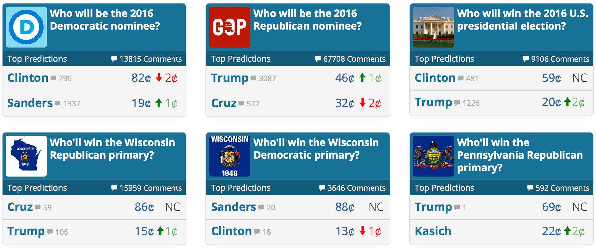
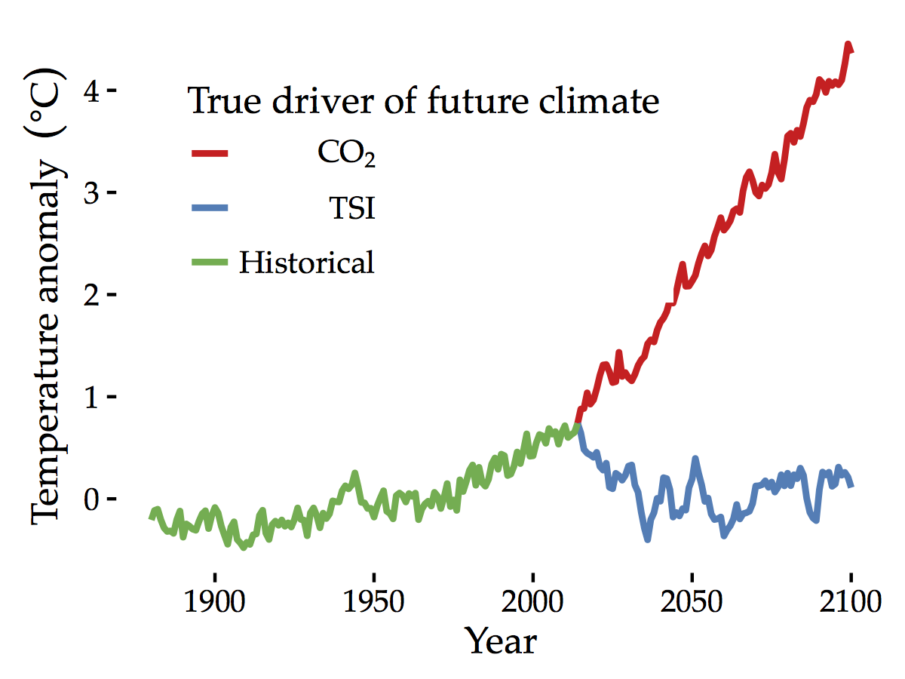
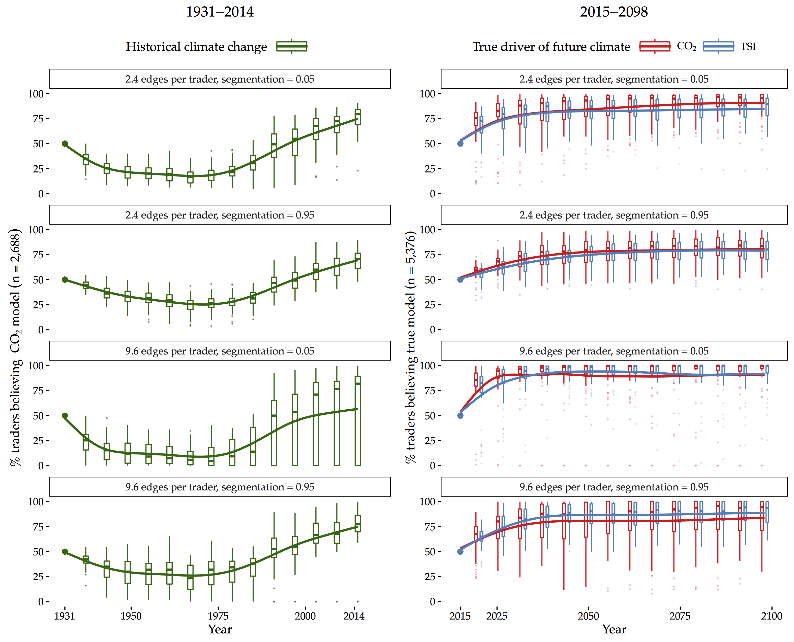
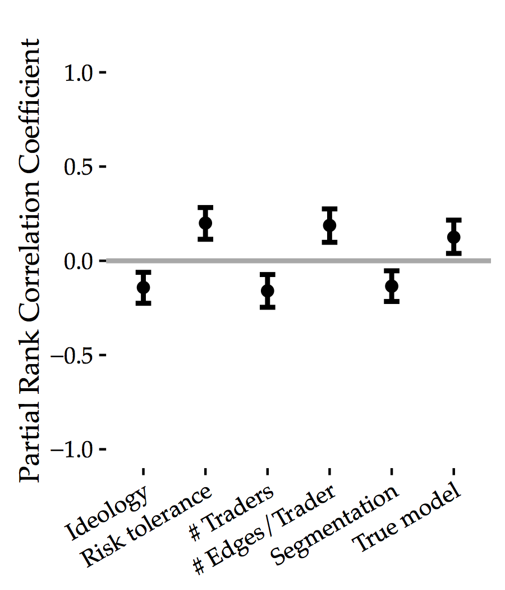

```{r setup, include=FALSE}
knitr::opts_chunk$set(echo = FALSE, message = FALSE)
```

```{r prep}
library(ggplot2)
theme_set(theme_classic())
library(pander)
```

## Prediction Markets

```{r}

```

## Climate Change and Prediction Markets

- Scientific consensus on anthropogenic nature of climate change strongly increased.
- BUT, beliefs about climate change did not evolve much within public. Increasingly politicized.
- Prediction markets: participants can "put their money where their mouths are."
- High prediction accuracy and information aggregation.
- Do they also change beliefs?

## Prediction Market Simulation

- Research question: *whether, and under what social and climate conditions, might prediction markets be useful for increasing convergence of climate beliefs?*
- Prediction markets (hypermind.com, betfair.com, and predictit.org) focus on near term events such as elections months away, so difficult to extrapolate to climate case.
- Investigating unobservable beliefs of traders. 
- So, simulation modeling informed by climate and economic theory.

## Two Alternate Realities

```{r}

```

## Trader Beliefs

- Both when true data generating process is CO2 and TSI, at model initialization approximately half of traders use true data-generating model to make predictions. 
- Traders using true model do not necessarily make perfectly accurate predictions. 
- Although these traders believe in correct *functional form* of model, they still need to calibrate their model based on limited noisy data. 

## Social Network

```{r}
knitr::include_graphics("markfigs/network.png")
```

## Model

1. Trader agents estimate forecasting model with data.
2. Make predictions for climate for 6 yrs from now to assign expected value to temp securities.
3. Trade on market.
4. Payoffs for owners of security that was correct.
5. Decide whether to adopt neighbors model based on cumulative earnings.

## Parameters

- $ideo \sim \text{Uniform}(0,1)$
- $n.edge \sim \text{Uniform}(100,200)$ (mapped into integer)
- $n.traders \sim \text{Uniform}(50,250)$ (mapped into integer)
- $risk.tak  \sim \text{Uniform}(0,1)$
- $seg \sim \text{Uniform}(0,1)$
- $true.model \sim \text{Bernoulli}(0.5)$

## Convergence Over Time

```{r}

```

## Sensitivity Analysis Design

- Stochasticity in tempertature data, social network structure, and agent decision models.
- 10 full simulations for each of 500 input parameter sets and average.
- Partial rank correlation coefficient analysis on relationship between input matrix, $X$, and resulting simulated outcome vector of mean belief convergence scores, $y$. 
- Partial correlation: linear relationship between part of variation of $X_i$ and $y$ that are linearly independent of other $X_j$  ($j \neq i$). 
- To allow potentially non-linear relationships $y$ is first rank-transformed.
- 1,000 bootstrapped estimations of PRCC to obtain 95\% confidence intervals.

## Sensitivity Analysis Results

```{r}

```

## References
