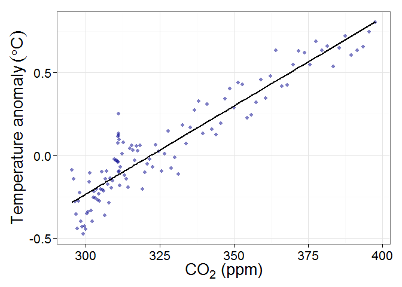
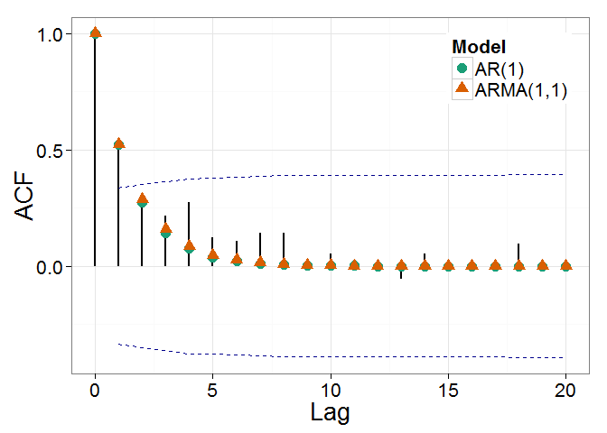
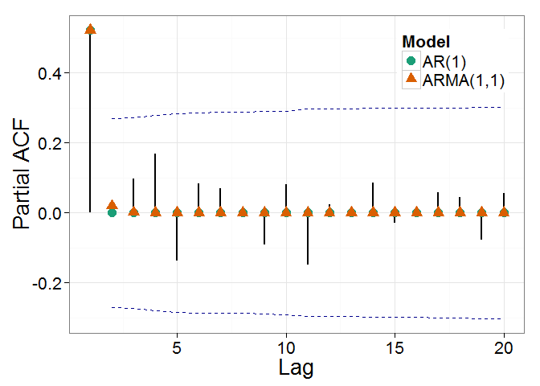
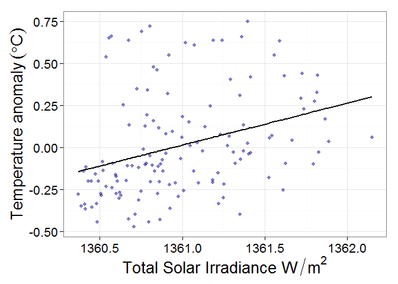
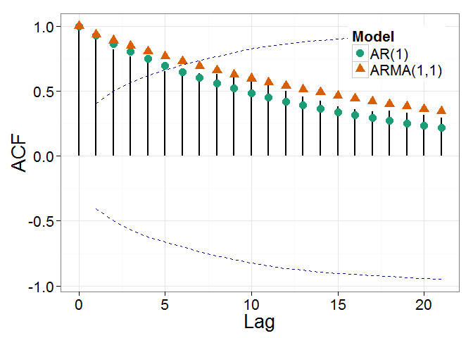
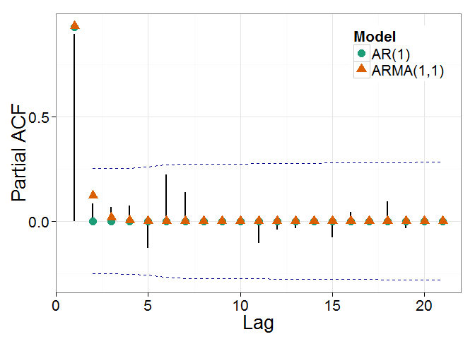
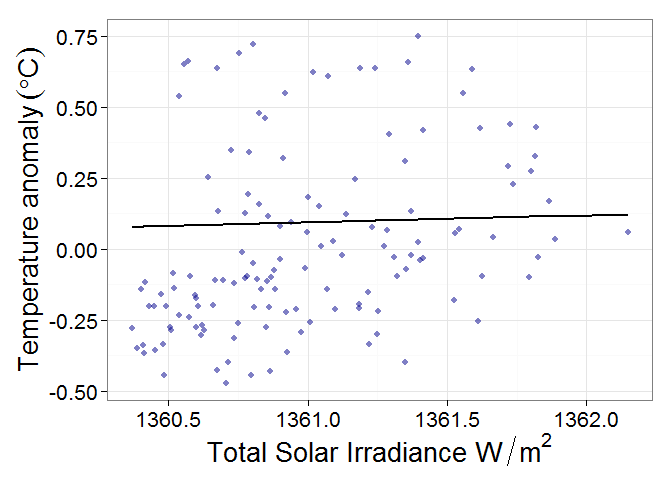

# Modeling Temperature
Jonathan Gilligan  
September 17, 2015  

# Modeling the temperature

We model the temperature as a time-series with ARMA noise.


First, we load the data.

```r
library(dplyr)
```

```
## 
## Attaching package: 'dplyr'
## 
## The following objects are masked from 'package:stats':
## 
##     filter, lag
## 
## The following objects are masked from 'package:base':
## 
##     intersect, setdiff, setequal, union
```

```r
source('load_giss.R')
source('load_keeling.R')
source('paleo_co2.R')

scinot <- function(x, places, uthreshold = 3, lthreshold = 1-places) {
  lx <- log10(x)
  ex <- floor(lx)
  mx <- lx %% 1
  if (ex >= uthreshold || ex <= lthreshold)
    paste(signif(10^mx,places),' \\times 10^{',ex,'}',sep='')
  else 
    signif(x,places)
}

t <- load_giss_data()$data %>% group_by(year) %>% summarize(t.anom = mean(t.anom)) %>% ungroup() %>% filter(!is.na(t.anom)) %>% mutate(year = year + 0.5)
co2 <- readRDS('data/smoothed_co2.Rds')


sunspots <- read.csv('data/SN_ms_tot_V2.0.csv', sep=';', header=F)
names(sunspots) <- c('year','month','frac.year','ss','sd','nobs','def')
sunspots <- sunspots %>% mutate(ss = ifelse(ss >= 0, ss, NA)) %>% group_by(year) %>% summarize(ss = mean(ss)) %>% ungroup() %>% filter(! is.na(ss)) %>% mutate(year = year + 0.5)

tsi <- tsi <- read.table('data/TSI_TIM_Reconstruction.txt', comment.char = ';')
names(tsi) <- c('year','tsi')
tsi$xtsi <- tsi$tsi
for(i in seq_along(tsi)[-1]) tsi$xtsi[i] <- 0.05 * tsi$tsi[i] + 0.95 * tsi$xtsi[i-1]

data <- merge(t, co2, all.x = TRUE)
data.solar <- merge(data, sunspots, all.x = TRUE)
data.solar <- merge(data.solar, tsi, all.x = TRUE)
```

Now fit a linear model of $t$ vs. $\mathrm{CO}_2$.

```r
d <- na.omit(data %>% select(year, t.anom, co2))
co2.lin <- lm(t.anom ~ co2, data = d)
co2.res <- data.frame(year = d$year, r = residuals(co2.lin))

p <- predict(co2.lin)
```

Plot the data vs. model to check whether things look sensible:

```r
library(ggplot2)

ggplot(cbind(d,predict = p), aes(x = co2, y = t.anom)) + 
  geom_point(size = 2, color = "dark blue", alpha=0.5, na.rm=T) + 
  geom_line(aes(y=predict), size=1, na.rm=T) +
  labs(x = expression(paste(CO[2]," (ppm)")), 
       y = expression(paste("Temperature anomaly ", (degree * C)))) +
  theme_bw(base_size=20)
```

 

Next, we look at the autocorrelation characteristics of the fit residuals:

```r
library(tseries)
library(nlme)
```

```
## 
## Attaching package: 'nlme'
## 
## The following object is masked from 'package:dplyr':
## 
##     collapse
```

```r
source('acftest.R')

co2.ar1 <- arma(co2.res$r, order=c(1,0), include.intercept = FALSE, method="BFGS")
co2.arma11 <- arma(co2.res$r, order=c(1,1), include.intercept = FALSE, method="BFGS")

co2.aic <- c(ar1 = summary(co2.ar1)$aic, arma11 = summary(co2.arma11)$aic)
use_arma_co2 <- co2.aic['ar1'] > co2.aic['arma11']

acftest(co2.res, co2.arma11, co2.ar1, ci.type='ma')
```

 

```r
acftest(co2.res, co2.arma11, co2.ar1, type='partial', ci.type='ma')
```

 

According to the Akaike Information Criterion, the AR(1) model is \(2.7\) times more likely than the the ARMA(1,1) model. 

```r
if (use_arma_co2) {
  cs <- corARMA(coef(co2.arma11), p=1, q=1, form=~1)
} else {
  cs <- corAR1(coef(co2.ar1), form = ~1)
}
model.cst <- Initialize(cs, data = d)
model.gls <- gls(t.anom ~ co2, data = d, correlation=model.cst)
p <- predict(model.gls)
d$predicted <- predict(model.gls)
```

```r
ggplot(d, aes(x = co2, y = t.anom)) + 
  geom_point(color = "dark blue", size=2, alpha = 0.5, na.rm=T) +
  geom_line(aes(y = predicted), size=1, na.rm=T) + 
  labs(x = expression(paste(CO[2]," (ppm)")), 
       y = expression(paste("Temperature anomaly ", (degree * C)))) +
  theme_bw(base_size = 20)
```

 

```r
ggplot(d, aes(x = year, y = t.anom)) + 
  geom_point(color = "dark blue", size=2, alpha = 0.5, na.rm=T) +
  geom_line(aes(y = predicted), size=1, na.rm=T) + 
  labs(x = "Year",
       y = expression(paste("Temperature anomaly ", (degree * C)))) +
  theme_bw(base_size = 20)
```

 

Now fit a linear model of $t$ vs. TSI #.

```r
d.tsi <- na.omit(data.solar %>% select(year, t.anom, tsi = xtsi))
tsi.lin <- lm(t.anom ~ tsi, data = d.tsi)
tsi.res <- data.frame(year = d.tsi$year, r = residuals(tsi.lin))

p.tsi <- predict(tsi.lin)
```

Plot the data vs. model to check whether things look sensible:

```r
library(ggplot2)

ggplot(cbind(d.tsi,predict = p.tsi), aes(x = tsi, y = t.anom)) + 
  geom_point(size = 2, color = "dark blue", alpha=0.5, na.rm=T) + 
  geom_line(aes(y=predict), size=1, na.rm=T) +
  labs(x = expression(paste("Total Solar Irradiance ", W / m^2)),
       y = expression(paste("Temperature anomaly ", (degree * C)))) +
  theme_bw(base_size=20)
```

 

Next, we look at the autocorrelation characteristics of the fit residuals:

```r
tsi.ar1 <- arma(tsi.res$r, order=c(1,0), include.intercept = FALSE, method="BFGS")
tsi.arma11 <- arma(tsi.res$r, order=c(1,1), include.intercept = FALSE, method="BFGS")

tsi.aic <- c(ar1 = summary(tsi.ar1)$aic, arma11 = summary(tsi.arma11)$aic)
use_arma_tsi <- tsi.aic['ar1'] > tsi.aic['arma11']

acftest(tsi.res, tsi.arma11, tsi.ar1, ci.type='ma')
```

 

```r
acftest(tsi.res, tsi.arma11, tsi.ar1, type='partial', ci.type='ma')
```

 

According to the Akaike Information Criterion, the AR(1) model is \(1.2\) times more likely than the the ARMA(1,1) model. 
Now that this is settled, let's do a generalized least-squares fit using an AR(1) noise model:

```r
if (use_arma_tsi) {
  cs.tsi <- corARMA(coef(tsi.arma11), p = 1, q = 1, form = ~1)
} else {
  cs.tsi <- corAR1(coef(tsi.ar1), form=~1)
}
model.cst.tsi <- Initialize(cs.tsi, data = d.tsi)
model.gls.tsi <- gls(t.anom ~ tsi, data = d.tsi, correlation=model.cst.tsi)
d.tsi$predicted.tsi <- predict(model.gls.tsi)
```

```r
ggplot(d.tsi, aes(x = tsi, y = t.anom)) + 
  geom_point(color = "dark blue", size=2, alpha = 0.5, na.rm=T) +
  geom_line(aes(y = predicted.tsi), size=1, na.rm=T) + 
  labs(x = expression(paste("Total Solar Irradiance ", W / m^2)),
       y = expression(paste("Temperature anomaly ", (degree * C)))) +
  theme_bw(base_size = 20)
```

 

```r
ggplot(d.tsi, aes(x = year, y = t.anom)) + 
  geom_point(color = "dark blue", size=2, alpha = 0.5, na.rm=T) +
  geom_line(aes(y = predicted.tsi), size=1, na.rm=T) + 
  labs(x = "Year",
       y = expression(paste("Temperature anomaly ", (degree * C)))) +
  theme_bw(base_size = 20)
```

 
